# Numerico_23-1 <!-- omit in toc -->

- [Semana 1](#semana-1)
    - [Aceleración de convergencia](#aceleración-de-convergencia)
    - [Representación de numeros enteros en un ordenador](#representación-de-numeros-enteros-en-un-ordenador)
- [Semana 2](#semana-2)
    - [Representación de números reales](#representación-de-números-reales)
    - [Propagación de errores](#propagación-de-errores)
    - [Notación de Landau](#notación-de-landau)
    - [Pérdida de dígitos significativos](#pérdida-de-dígitos-significativos)
    - [Número de condición](#número-de-condición)
- [Semana 3. Sistemas de ecuaciones. Métodos directos](#semana-3-sistemas-de-ecuaciones-métodos-directos)
    - [Estabilidad de los algoritmos](#estabilidad-de-los-algoritmos)
    - [Eliminación de Gauss](#eliminación-de-gauss)
    - [Gauss-Jordan](#gauss-jordan)
    - [Pivoteo parcial](#pivoteo-parcial)
    - [Pivoteo total](#pivoteo-total)
- [Semana 4. Factorización de matrices](#semana-4-factorización-de-matrices)
    - [LU](#lu)
    - [PA = LU](#pa--lu)
    - [LDLT](#ldlt)
    - [LLT (Cholesky)](#llt-cholesky)
- [Semana 5](#semana-5)
    - [Método de Schur](#método-de-schur)
    - [Descomposición SVD](#descomposición-svd)
    - [Número de condición de una matriz](#número-de-condición-de-una-matriz)
    - [Matrices simétricas semidefinidas positivas](#matrices-simétricas-semidefinidas-positivas)
    - [Método de Parlet y Reid.](#método-de-parlet-y-reid)
- [Semana 6. Métodos iterativos para sistemas de ec. lin.](#semana-6-métodos-iterativos-para-sistemas-de-ec-lin)
    - [Richardson](#richardson)
    - [Jacobi-Richardson](#jacobi-richardson)
    - [Gauss-Seidel](#gauss-seidel)
- [Semana 7](#semana-7)
    - [Relajación](#relajación)
    - [Descenso más rápido](#descenso-más-rápido)
    - [Máximo descenso](#máximo-descenso)
    - [Gradiente conjugado](#gradiente-conjugado)
- [Semana 8](#semana-8)
- [Semana 9](#semana-9)
    - [Mínimos cuadrados](#mínimos-cuadrados)
    - [Factorización QR](#factorización-qr)
    - [Transformación de Householder](#transformación-de-householder)
- [Semana 10](#semana-10)
  - [Clase 17](#clase-17)
    - [Resolución numérica de Ax = b con m \> n y rango incompleto](#resolución-numérica-de-ax--b-con-m--n-y-rango-incompleto)
    - [Transformaciones de Givens](#transformaciones-de-givens)
  - [Clase 18. Ecuaciones no lineales](#clase-18-ecuaciones-no-lineales)
    - [Bisección](#bisección)
    - [Regla falsa](#regla-falsa)
    - [Regla falsa modificada](#regla-falsa-modificada)
- [Semana 11](#semana-11)
  - [Clase 19](#clase-19)
    - [Secante](#secante)
    - [Punto Fijo](#punto-fijo)
    - [Newton](#newton)
  - [Clase 20. Sistemas de ecuaciones no lineales](#clase-20-sistemas-de-ecuaciones-no-lineales)
    - [Punto fijo](#punto-fijo-1)
    - [Newton](#newton-1)
- [Semana 12](#semana-12)
    - [Homotopía](#homotopía)
    - [Cuasi-Newton](#cuasi-newton)
    - [Teorema de Gershgorin](#teorema-de-gershgorin)
    - [Potencia](#potencia)
    - [Potencia desplazada](#potencia-desplazada)
- [Semana 13](#semana-13)
    - [Interpolación de Newton](#interpolación-de-newton)
    - [Interpolación de Lagrange](#interpolación-de-lagrange)

**Scripts de Python:**

https://github.com/AldoLunaBueno/Analysis-and-Numerical-Modeling-I

https://github.com/bardend/Analysis-and-Numerical-Modeling-I
## Semana 1

#### Aceleración de convergencia
#### Norma vectorial y matricial
#### Representación de numeros enteros en un ordenador

## Semana 2
#### Representación de números reales
#### Propagación de errores
#### Notación de Landau
#### Pérdida de dígitos significativos
#### Número de condición

**Para funciones:**

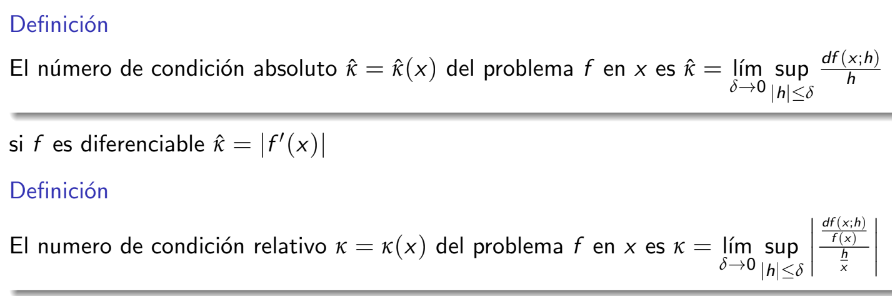

Ejemplo:

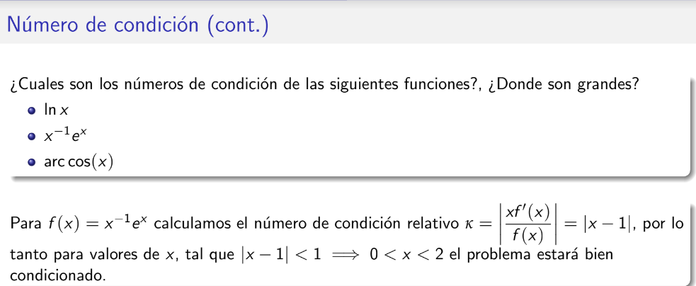

**Para matrices:**

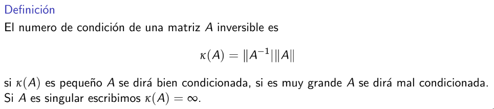

## Semana 3. Sistemas de ecuaciones. Métodos directos

#### Estabilidad de los algoritmos
#### Eliminación de Gauss
#### Gauss-Jordan
#### Pivoteo parcial

Se trabaja solo con las filas.

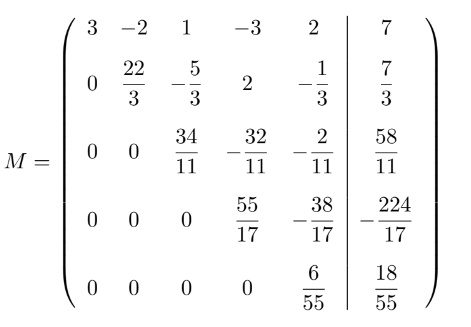

#### Pivoteo total

Similar, pero con operaciones entre columnas además de entre filas. Para hacer seguimiento de las columnas se usa un vector auxiliar llamado Ind.

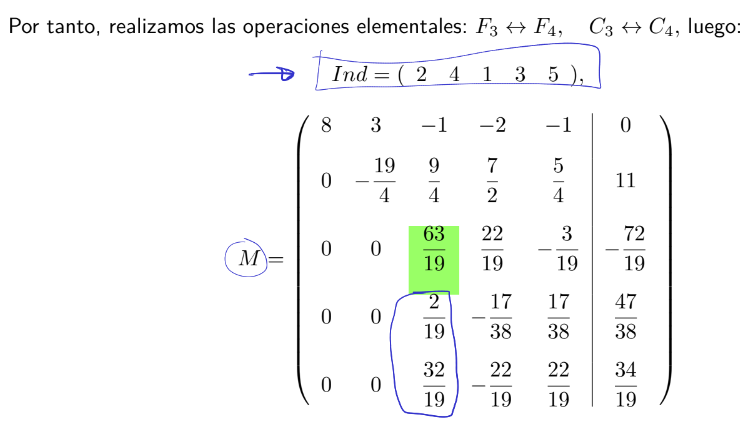

## Semana 4. Factorización de matrices

#### LU

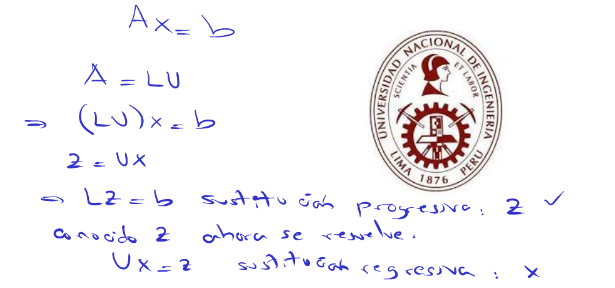

Teorema de la existencia de la descomposición LU:

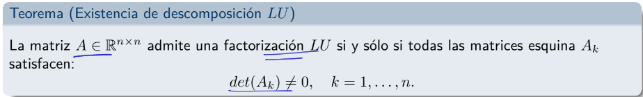

Donde las matrices esquina se definen como:

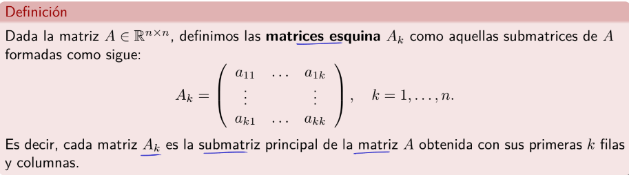

Se puede hacer por el método de Doolitle (fila por fila) o por el de Crout (columna por columna). Este es el de Doolitle:

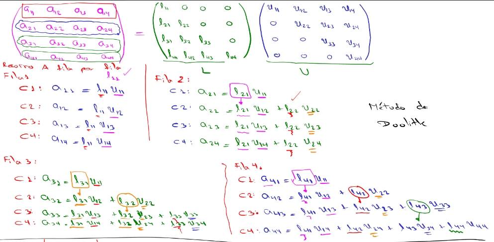

#### PA = LU
#### LDLT
#### LLT (Cholesky)

---
## Semana 5

#### Método de Schur
#### Descomposición SVD
#### Número de condición de una matriz
#### Matrices simétricas semidefinidas positivas
#### Método de Parlet y Reid.

---
## Semana 6. Métodos iterativos para sistemas de ec. lin.

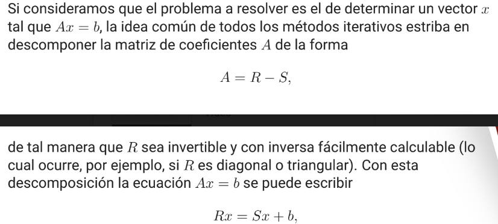

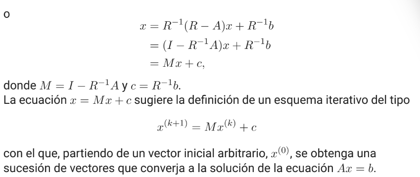

Lo más importante es que vamos de una matriz A del sistema que queremos resolver a una matriz M del esquema iterativo.

La convergencia de cualquiera de los métodos se puede verificar de forma general si demostramos que M es convergente:

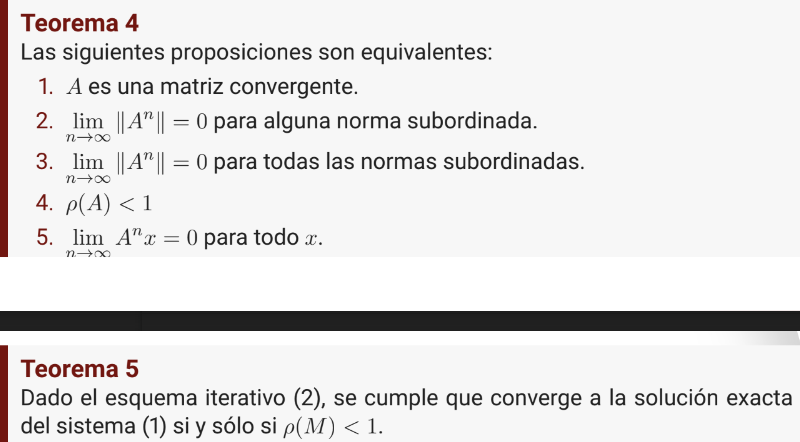

#### Richardson

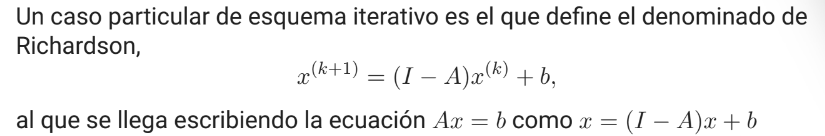

#### Jacobi-Richardson

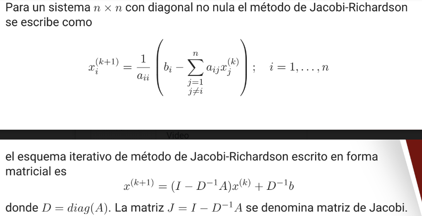

Criterio de parada:

#### Gauss-Seidel

---
## Semana 7

#### Relajación

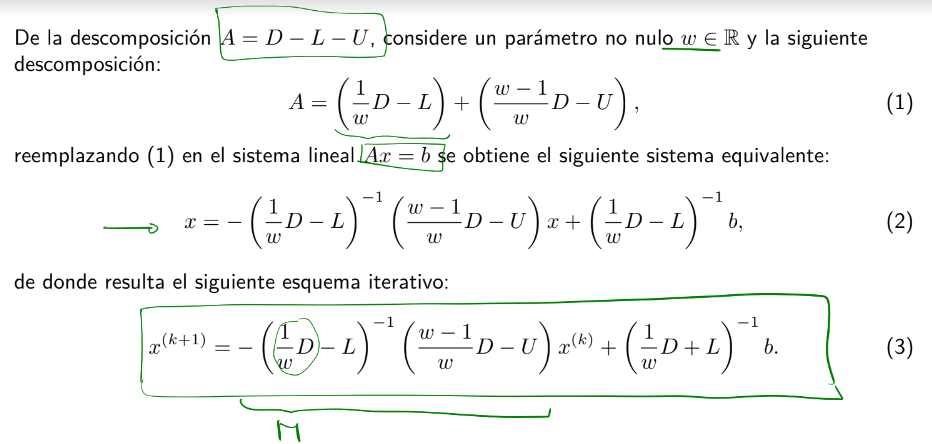

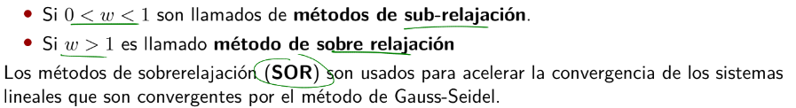

Convergencia:

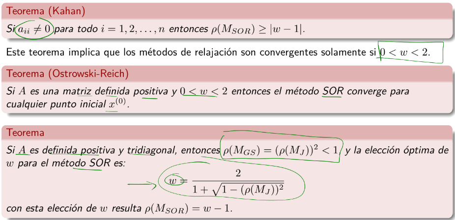

#### Descenso más rápido
#### Máximo descenso
#### Gradiente conjugado

---
## Semana 8
Examen parcial

---
## Semana 9

#### Mínimos cuadrados
#### Factorización QR
#### Transformación de Householder

---
## Semana 10

### Clase 17

#### Resolución numérica de Ax = b con m > n y rango incompleto
#### Transformaciones de Givens

### Clase 18. Ecuaciones no lineales

#### Bisección
#### Regla falsa
#### Regla falsa modificada

---
## Semana 11

### Clase 19
#### Secante
#### Punto Fijo
#### Newton

Fórmula iterativa:

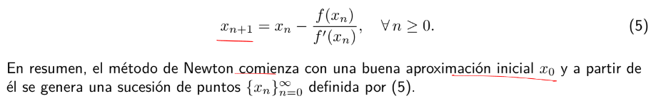

Gráficamente:

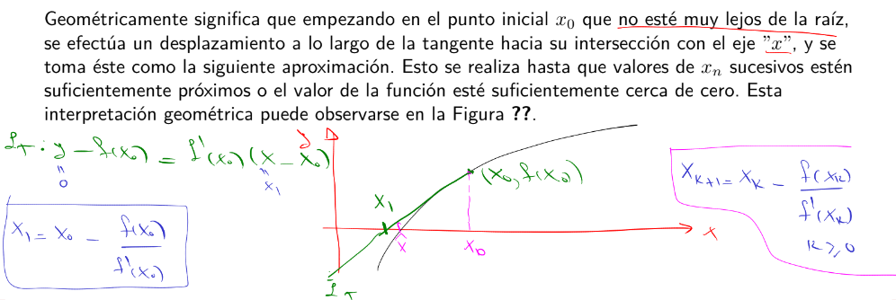

Análisis de la convergencia (error)

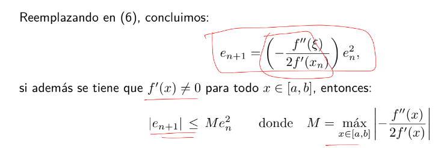

¿Cuántas iteraciones para llegar a cierto margen de error?

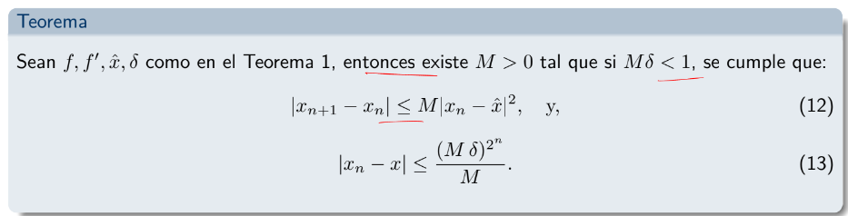

### Clase 20. Sistemas de ecuaciones no lineales
#### Punto fijo

Ejemplo:

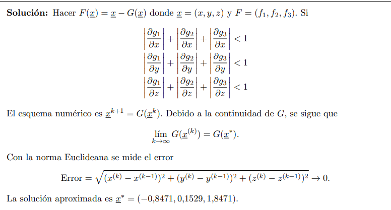

#### Newton

---
## Semana 12

#### Homotopía
#### Cuasi-Newton
#### Teorema de Gershgorin
#### Potencia
#### Potencia desplazada

## Semana 13

#### Interpolación de Newton

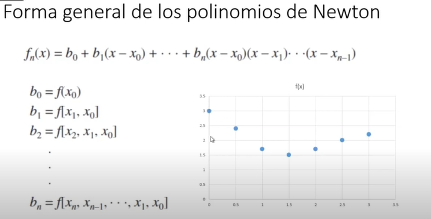

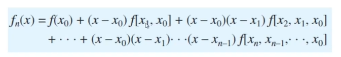

Cálculo de los coeficientes:

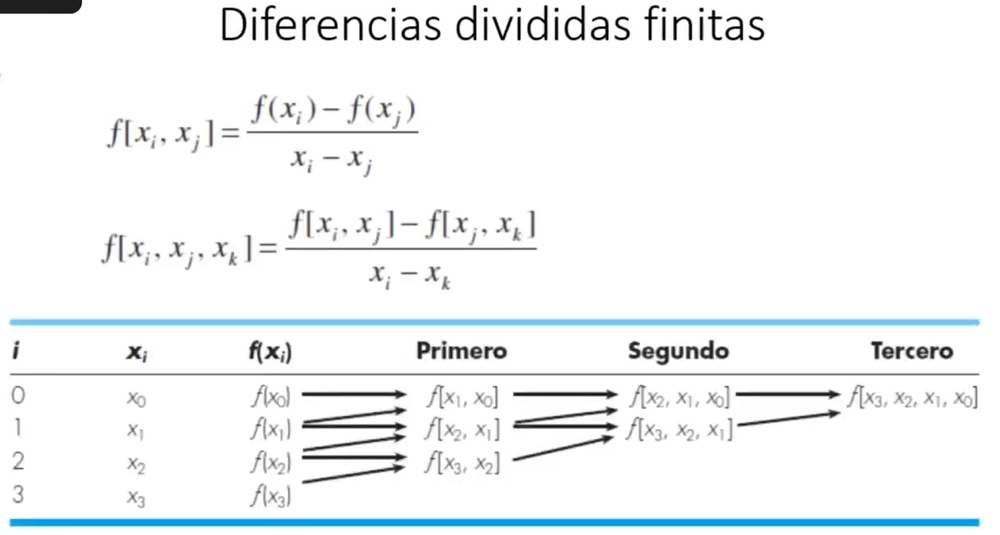

Ejemplo:

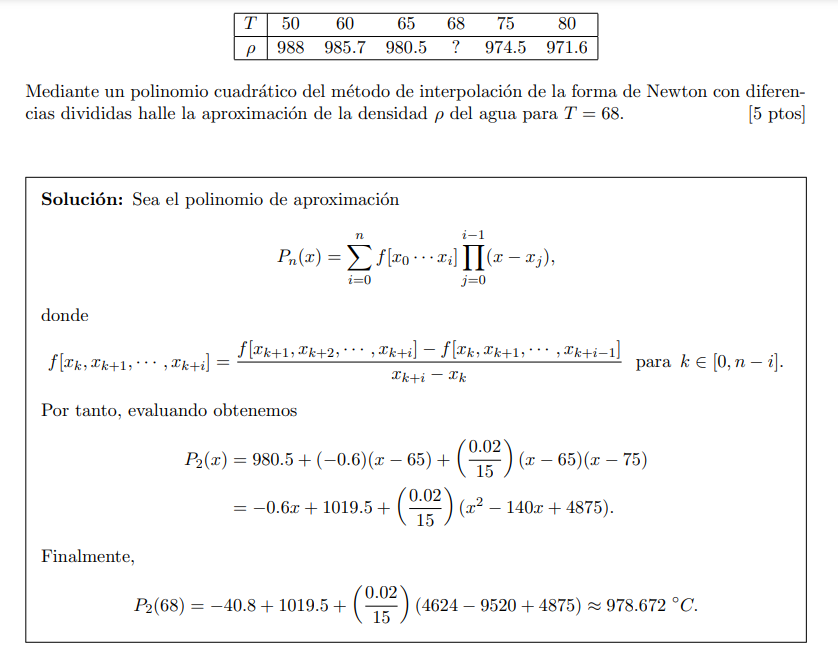

Solo usas los datos necesarios para el polinomio del grado que te piden (si quieres de grado 2, necesitas 2+1 pares de datos).

#### Interpolación de Lagrange

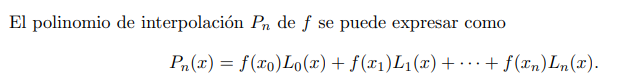

Donde

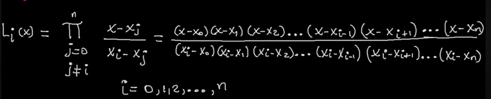

Ejemplo:

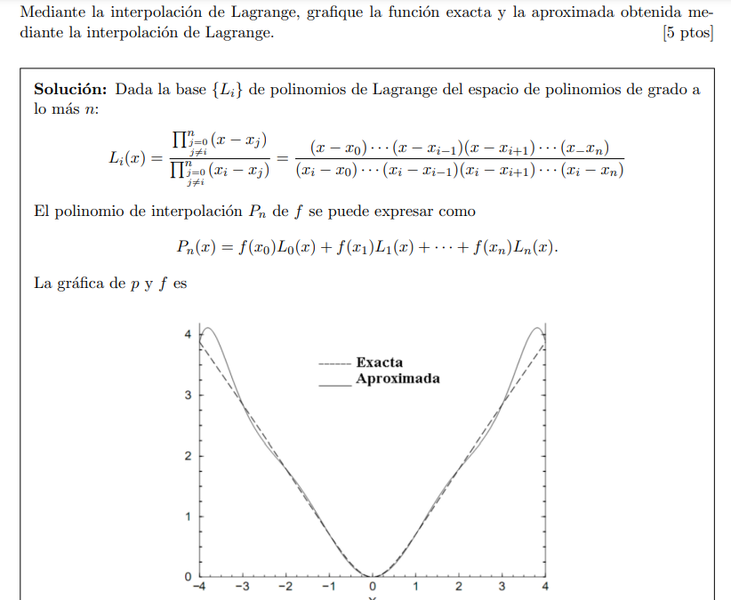
